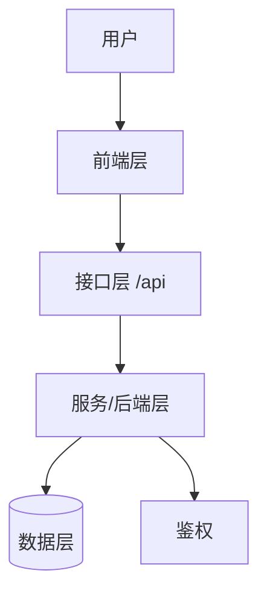

# 代码库分析规范（步骤 1）

**目标**：建立对被测系统的结构性认知，为后续需求分析与测试设计提供锚点。无论项目是 Web、桌面、API 还是混合架构，本步骤产出一份可被人和 AI 共同消费的「模块矩阵」。

---

## 1. 必须收集的信息

### 1.1 基础信息

| 项 | 说明 | 收集方式 |
|---|---|---|
| 技术栈 | 框架 / 语言 / 主要依赖 | `package.json` / `requirements.txt` / `pom.xml` |
| 前端入口 | 主路由、路由表 | 查找 `Routes`、`router`、路由配置文件 |
| 后端入口 | API 路由表 | 查找 `app.use`、`@RestController`、路由注册 |
| 数据模型 | DB schema、ORM 实体 | `schema.sql`、`migrations/`、`models/` |
| 鉴权机制 | 登录方式、角色、Token | 查找 `auth`、`jwt`、`middleware` |
| 核心接口 | 各模块关键 API（方法+路径+用途+鉴权） | 路由注册、`fetch`/`axios` 调用、controller |
| 已有测试 | 测试目录、框架 | `tests/`、`*.spec.*`、`*.test.*` |

### 1.2 模块识别

按下列优先级识别「模块」：

1. **路由分组**（Web 项目）：每个一级路由 = 一个模块
2. **页面文件组织**（前端）：`pages/auth/*` → `auth` 模块
3. **API 路由分组**（后端）：`/api/users/*` → `users` 模块
4. **领域目录**（DDD 项目）：`domain/order/*` → `order` 模块

---

## 2. 输出格式

写入 `/AI_LabTest/analysis/codebase-overview.md`，模板如下：

```markdown
# 代码库分析 — {项目名}

**生成时间**：YYYY-MM-DD
**项目类型**：Web / 桌面 / API / 混合
**主要技术栈**：{技术栈摘要}

## 技术架构图（强制）

用 **Mermaid** 输出系统分层架构图，直观展示分层与数据流；节点用项目真实名称：



模块较多时，再附一张「模块依赖图」（Mermaid，节点=模块，箭头=依赖方向）。

## 模块矩阵

| 模块 | 入口路由 | 主要功能 | 关键交互 | 核心接口 | 数据依赖 | 鉴权要求 | 测试优先级 |
|------|----------|----------|----------|----------|----------|----------|-----------|
| auth | /login   | 登录/登出 | 表单提交 | `POST /api/auth/login` | users 表 | 无→有 | P0 |
| ...  | ...      | ...      | ...      | ...      | ...      | ...   | ... |

> **核心接口**列：列出该模块的关键 API（HTTP 方法 + 路径），标注用途与是否鉴权；纯前端动作可写关键交互入口。这是后续需求发现与用例设计的锚点。

## 鉴权体系

- 方式：JWT / Session / OAuth / ...
- 角色：admin / user / ...
- 受保护资源：...

## 数据生命周期

| 实体 | 创建 | 读取 | 更新 | 删除 | 关联 |
|------|------|------|------|------|------|
| ...  | ...  | ...  | ...  | ...  | ...  |

## 已有测试

- 框架：{Playwright / Jest / ...}
- 位置：{...}
- 覆盖率（如可观察）：{...}

## 风险与注意事项

- {AI 在扫描代码时发现的可能影响测试设计的因素}
- 例：「register 路由不存在但 UI 有注册入口 — 需求阶段需确认」
```

---

## 3. 测试优先级建议

按下列原则给模块标 P0/P1/P2，**但最终优先级以用户确认为准**：

| 优先级 | 触发条件 | 含义 |
|--------|----------|------|
| **P0** | 涉及鉴权、支付、数据修改、核心业务流程 | 必须覆盖 |
| **P1** | 普通 CRUD、统计、列表 | 应该覆盖 |
| **P2** | 纯展示、辅助页面、管理后台 | 可以覆盖 |

---

## 4. 用户门控

呈现以下问题让用户确认：

1. **测试范围**：本轮要测试哪些模块？（多选）
2. **排除项**：是否有需要排除的模块？
3. **执行环境**：测试将在哪个环境运行？（本地 / 测试环境 URL）
4. **数据策略**：测试是否需要预置数据 / 测试账号？

未获得用户对范围的明确确认，**不得进入步骤 2**。

---

## 5. 失败处理

- 代码库过大无法完整扫描时：先扫描根目录 + 用户指定模块
- 技术栈无法识别时：列出已识别的部分，直接询问用户
- 鉴权机制不明确时：标注 `UNKNOWN_AUTH` 留待步骤 2 与用户确认
